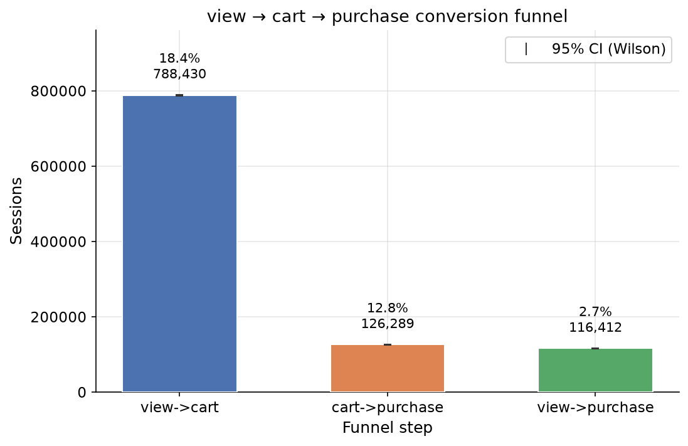
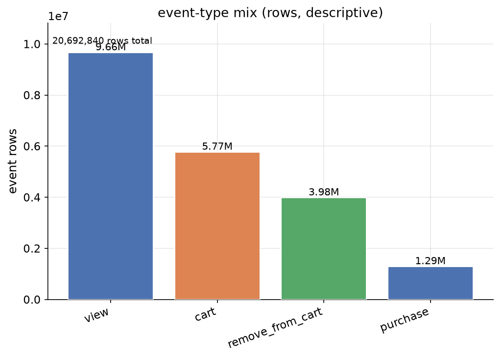
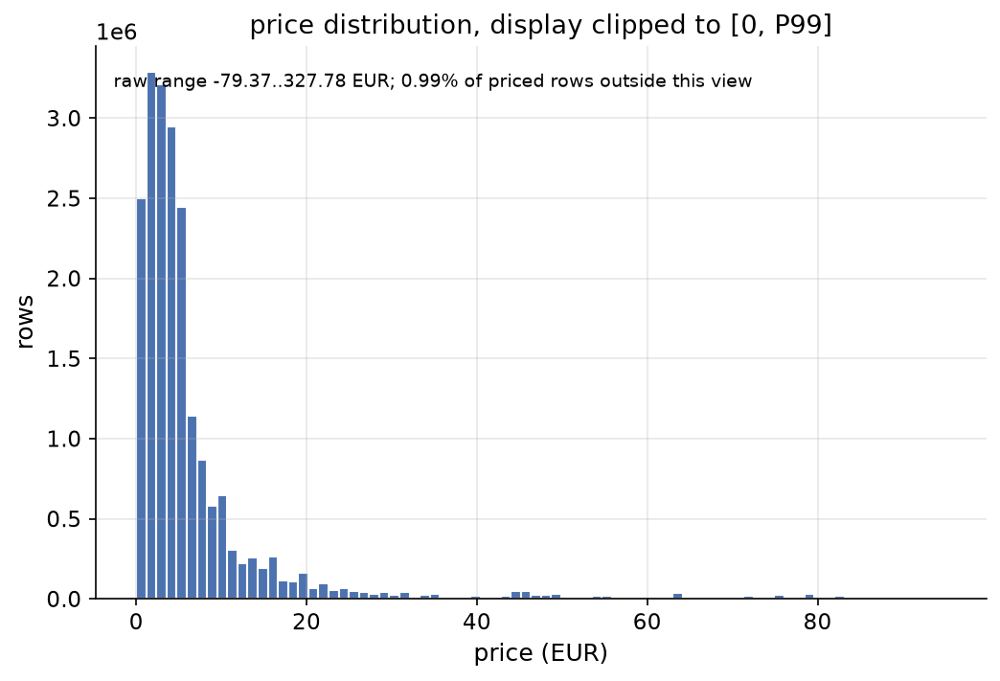
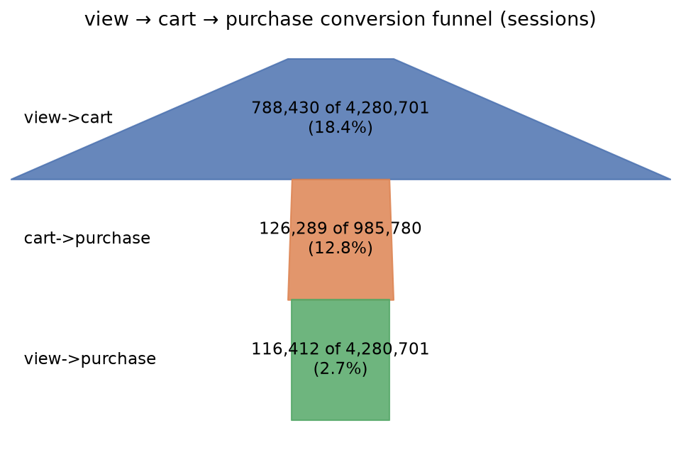
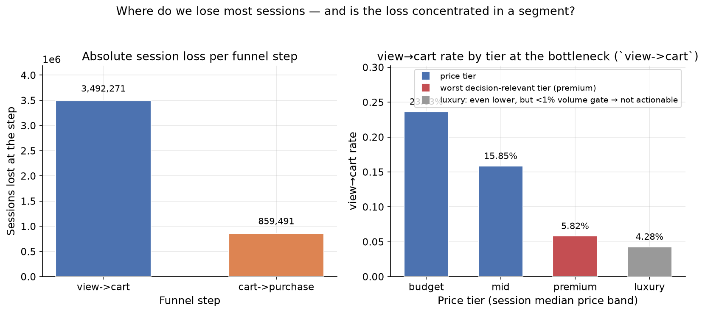
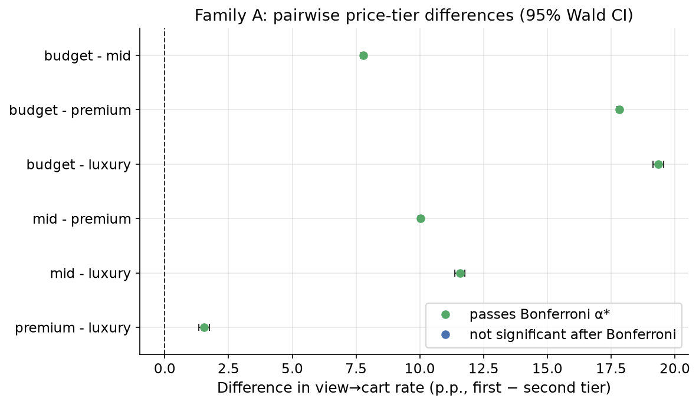
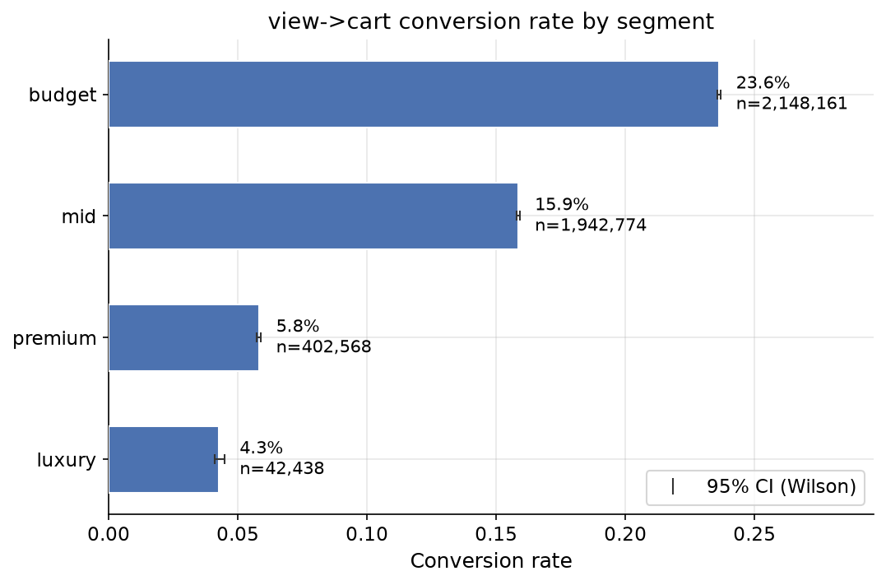
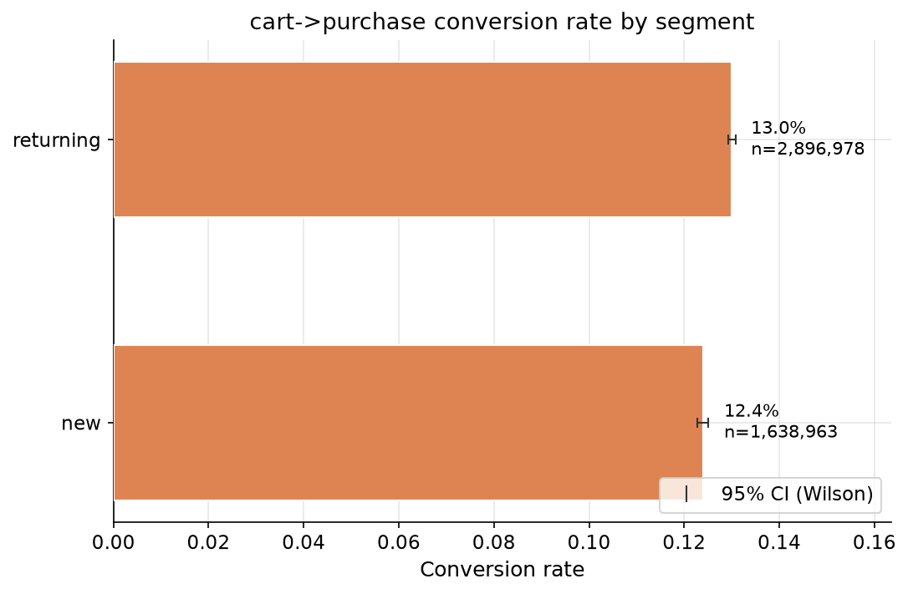
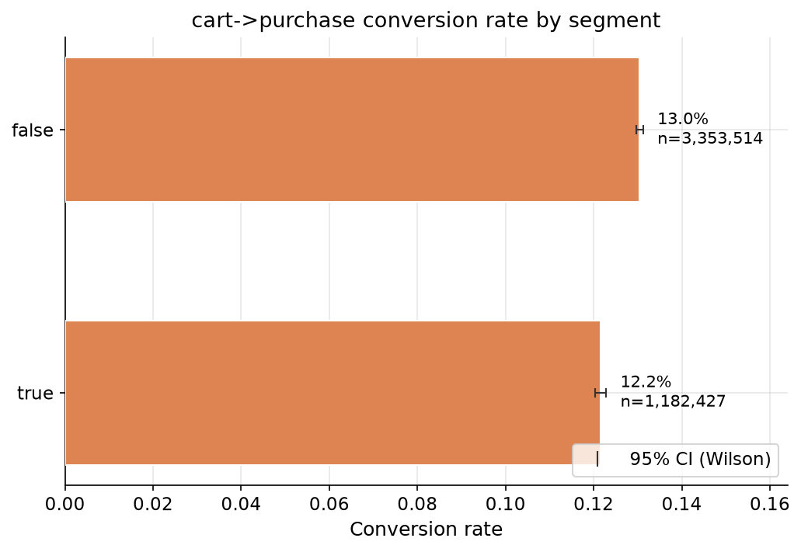
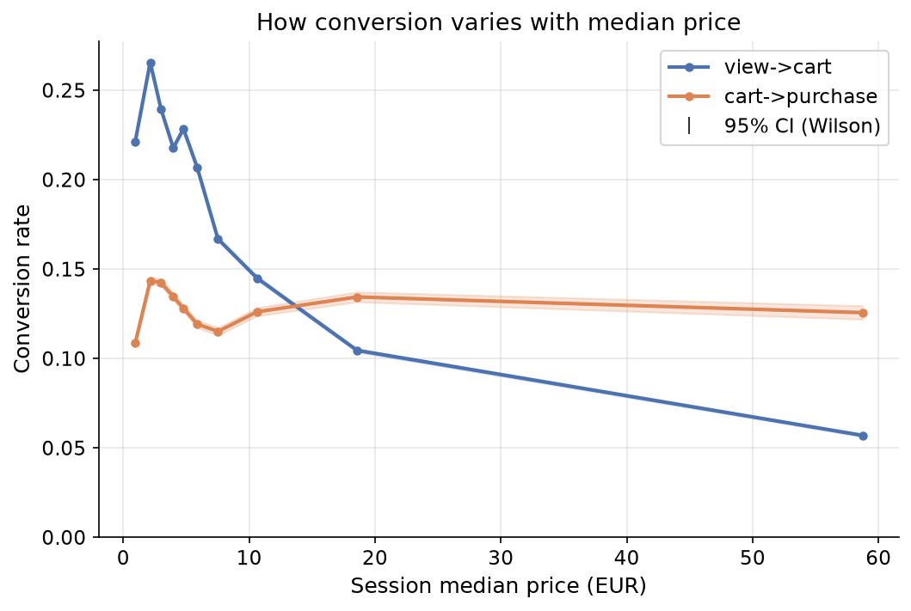

# E-Commerce Funnel Analysis — View to Cart to Purchase

A statistically rigorous funnel-conversion analysis of a cosmetics e-commerce dataset: one pre-registered confirmatory design, three tested segment families, an honest robustness battery, and a sized A/B proposal for the single decision-relevant problem — premium-item discovery.

[](https://www.python.org/downloads/)
[](https://github.com/dimassaa/ecommerce-funnel-analysis)
[](LICENSE)
[](reports/pre_registration.md)

*Read this in [Русский](README_ru.md).*



## Table of contents

- [Introduction](#introduction)
- [Tech stack](#tech-stack)
- [Project structure](#project-structure)
- [Quick start](#quick-start)
- [Installation and usage](#installation-and-usage)
- [Data](#data)
- [Exploratory data analysis](#exploratory-data-analysis)
- [Methodology](#methodology)
- [Results](#results)
- [Business impact](#business-impact)
- [Testing](#testing)
- [Limitations](#limitations)
- [Recommendations](#recommendations)
- [Support](#support)
- [Contributing](#contributing)
- [License](#license)
- [Acknowledgements](#acknowledgements)

## Introduction

The project analyses the purchase funnel **(view → cart → purchase)** of an online cosmetics shop over five full months (October 2019 – February 2020) using the public Kaggle dataset *E-commerce Events History in Cosmetics Shop* by mkechinov.

The work answers a single business question: **where does the funnel lose the most customers, and is that loss concentrated in a segment we can act on?**

Unlike a typical exploratory notebook dump, this project is pre-registered: the hypothesis families, significance level, multiple-comparison correction and the practical-decision gate were pinned in `reports/pre_registration.md` *before* any confirmatory analysis ran. The confirmatory comparisons in notebook 04 follow that document exactly; notebook 06 stress-tests the verdict against reasonable re-specifications and honestly reports what flips.

The headline, in one line: the funnel loses most of its volume at **view → cart**, the loss concentrates in the **premium** price tier, and the recommended action is a sizeable A/B test on premium-item discovery.

## Tech stack

- **Python 3.12** — runtime, validated by the test suite.
- **polars** — all data loading, session feature engineering, funnel aggregation and segment workflows. Polars is used for two reasons: lazy/streaming evaluation keeps the 2.3 GB CSV set off-heap and never materialises it whole, and its Arrow-native columnar engine makes the session/reached-step joins fast enough to iterate on locally.
- **numpy / scipy** — z-tests, chi-squared tests, confidence intervals (Wilson, Wald).
- **statsmodels** — normal-approximation sample-size and power functions, BH-FDR multiple-correction (used only to *cross-validate* the hand-rolled `src/inference` functions).
- **matplotlib** — every committed chart in `assets/`, built from `src/plots.py`.
- **jupyter (nbclient / nbformat)** — notebooks are *generated programmatically* by `notebooks/build_*.py` builders via the shared runner `scripts/build_notebook.py`, so every `.ipynb` output is reproducible and `errors=none`.
- **pytest** — one test per calculation module, including cross-checks against `statsmodels`/`scipy`.
- **uv** — dependency management and the recommended environment tool.

## Project structure

```
src/                 Reusable calculation library (the single source of truth for analysis)
  data_io.py         Raw CSV -> parquet ingestion (lazy, schema-typed)
  eda.py             Integrity report: row counts, duplicates, missingness, reuse
  funnel.py          Session features + reached-step funnel rates + Wilson CIs
  inference.py       chi2, two-proportion z-test, sample size / power, sparse-cell gate
  segments.py        Price tiers and segmentation families, segment funnel
  plots.py           All committed assets
scripts/
  etl_events.py      Raw monthly CSVs -> data/processed/events.parquet + integrity gate
  etl_pipeline.py    events.parquet -> sessions.parquet + funnel report + jump diagnostics
  build_notebook.py  Shared notebook build-and-execute runner
notebooks/           Executed notebooks 01-06 + their build_*.py generators
tests/               pytest suite for src/ (80 tests)
reports/
  pre_registration.md         The pinned confirmatory plan (SHA 35317bc)
  05_executive_summary.html   HTML executive summary
assets/              The ten committed charts referenced below
data/                Raw CSVs + processed parquet (git-ignored, too large for git)
```

## Quick start

### Option A — uv (recommended)

This mirrors the environment the project was developed in.

```bash
uv venv                          # create .venv (Python 3.12)
uv pip install -e .              # install the package in editable mode
```

Use `uv run` to run any project script inside the environment, e.g. `uv run python scripts/etl_events.py`.

### Option B — venv + pip

```bash
python -m venv .venv
.venv/bin/pip install -e .
.venv/bin/python scripts/etl_events.py
.venv/bin/python scripts/etl_pipeline.py
```

Both data-preparation steps are idempotent: re-running them overwrites `events.parquet` and `sessions.parquet` with the same deterministic output.

### Option C — no code at all

Open `reports/05_executive_summary.html` in a browser. It is the one-file digest of the analysis, the verdict and the A/B proposal — no environment required.

## Installation and usage

1. Create the environment (Option A or B above).
2. Place the raw monthly CSV exports from Kaggle into `data/` (they are too large to commit; `data/*.csv` is git-ignored).
3. Build the analysis inputs in order:

   ```bash
   .venv/bin/python scripts/etl_events.py     # raw CSVs -> events.parquet
   .venv/bin/python scripts/etl_pipeline.py   # events.parquet -> sessions.parquet
   ```

4. Rebuild any notebook from its generator when needed (`notebooks/build_01_data_integrity.py` … `notebooks/build_06_robustness.py`). Every committed notebook is already executed; re-running the builder is only required after a code change.

5. Run the tests:

   ```bash
   .venv/bin/python -m pytest tests/ -q
   ```

## Data

**Source:** [E-commerce Events History in Cosmetics Shop](https://www.kaggle.com/datasets/mkechinov/ecommerce-events-history-in-cosmetics-shop) (Kaggle, mkechinov). Five full months of raw behavioural events (view, cart, purchase, remove_from_cart) for an online cosmetics shop.

| Quantity | Value |
|---|---|
| Events | 20,692,840 |
| Users | 1,639,358 |
| Sessions (distinct `user_session`) | 4,535,941 |
| Time window | 2019-10 … 2020-02 (5 full months, no pilot month) |

The unit of analysis is the **session** — one row per `user_session` — not the event row and not the user. This is pinned in the pre-registration and documented in `src/funnel.py`.

The dataset carries quirks that the integrity stage documented and the analysis absorbed:

| Quirk | Finding |
|---|---|
| `brand` missing | 42.3% of rows |
| `category_code` missing | 98.3% of rows (empty string counts as missing) |
| Exact duplicate rows | 1,109,098 verbatim-duplicated rows |
| `price` range | -79.37..327.78 EUR; 0.50% of rows priced at 0 — including **1 purchase** at price 0 |
| No device / channel / geo columns | segmentation had to be re-scoped to *product-attribute* segments (price tiers) instead |
| Session-id reuse | 272 session ids reused across different users |
| Session-ingestion detail | 4,598 rows with a null `user_session` are excluded (a row cannot belong to a session) |

Because `brand` and `category_code` are mostly missing and there is no user-device context, the confirmatory design compares **price tiers** (a product attribute computed per session) rather than demographic or acquisition segments.

## Exploratory data analysis

Notebooks 01–03 are descriptive by design — they establish *what is observed* and carry no significance claims (the pre-registration explicitly keeps them non-confirmatory).

- **Notebook 01 — Data integrity**: row/unit counts, duplicates, missingness, price sanity, session-id reuse. Its two charts are `assets/integrity_events_mix.png` (event-type mix and its weekly stability) and `assets/integrity_price_distribution.png` (price spread, zero-priced share, negative prices).
- **Notebook 02 — Funnel**: the headline view → cart → purchase funnel with Wilson confidence intervals (see [Methodology](#methodology)).
- **Notebook 03 — Segmentation**: descriptive view→cart rates by price tier, visit kind and weekday/weekend, which motivate the confirmatory families in notebook 04.



The event mix confirms the raw data is dominated by `view` events; purchase is a tiny tail of the volume — the reason the funnel comparison below is run on *sessions* (reached-step indicators), not raw event rows.



The price distribution is right-skewed with a mass of zero-priced rows; price handling (zero, negative, and the 1 zero-priced purchase) is documented in the integrity stage and pinned before segmentation.

## Methodology

### Funnel definition (reached-step indicators)

Each session is scored with reached-step booleans: `has_view`, `has_cart`, `has_purchase` (≥1 event of that type). Positions are independent — a session that purchases without a cart event contributes only to `has_purchase`, and the diagnostics below quantify exactly those jumps.

The three rates compared in this project:

| Rate | Definition |
|---|---|
| view→cart | P(cart \| view) — cart sessions among view sessions |
| cart→purchase | P(purchase \| cart) — purchase sessions among cart sessions |
| view→purchase | P(purchase \| view) — purchase sessions among view sessions |

Point estimates are reported with exact **95% Wilson confidence intervals** (hypergeometric-aware bound, `src/funnel`/`src/inference`).

### Price tiers (explanatory variable)

Fixed business bands, pinned before any tier × outcome was inspected (pre-registration §2):

| Tier | Band (EUR) | Sessions |
|---|---|---|
| budget | `< 5` (incl. 0 and negative prices) | 2,148,161 |
| mid | `[5, 30)` | 1,942,774 |
| premium | `[30, 150)` | 402,568 |
| luxury | `≥ 150` | 42,438 |
| **Total** | | **4,535,941** |

All four bands hold ≥ 500 sessions, so the pre-registered merge clause does not trigger (checked 2026-09-22).

### Confirmatory families

- **Family A** — price tier × view→cart: one 4×2 chi-squared omnibus plus the six pairwise two-proportion z-tests, run on view sessions.
- **Family B** — visit kind × cart→purchase: new vs returning sessions, one two-proportion z-test on cart sessions.
- **Family C** — weekday/weekend × cart→purchase: one two-proportion z-test on cart sessions.

### Decision rule (pre-registered, pinned before any output)

$$\text{decision-relevant} \iff \big(0 \notin \text{95%CI}(p_i - p_j)\big) \;\land\; \Big(\big|\tfrac{p_i - p_j}{p_{\min}}\big| \ge 0.10\Big) \;\land\; \big(\text{affected sessions} \ge 0.01 \cdot 4{,}535{,}941\big).$$

Concretely: a difference is **decision-relevant only if all three hold**:

1. the 95% CI of the difference excludes 0 (direction is statistically established), **and**
2. |relative uplift| ≥ 10% of the lower (baseline) rate, **and**
3. affected volume ≥ 1% of all sessions (≥ 45,360 of 4,535,941).

Multiplicity: α = 0.05 two-sided for every test; Family A's six pairwise tests share one family → **per-family Bonferroni** α* = 0.05/6 ≈ 0.0083. BH-FDR is reported as sensitivity only (it never sets the rejection rule). Any cell with expected count `n·p < 5` (or `χ² expected_min < 5`) runs **no test** for that comparison and is flagged `sparse=True`, reported descriptively.

**Consequence by design:** luxury (42,438 sessions = 0.94% of all sessions) can be statistically confirmed in a comparison but can never be decision-relevant — it sits below the 1% volume gate, a deliberate consequence of the pre-registered rule, not a data artefact.

### Sample-size / power relation

Used to *assess capability* of the confirmatory tests and to size the A/B proposal (pre-registration §7 — capability context, never a tuning knob for the pinned decision rule):

$$n = \left[\frac{z_{1-\alpha/2}\,\sqrt{2\bar{p}(1-\bar{p})} \;+\; z_{\text{power}}\,\sqrt{p_0(1-p_0) + p_1(1-p_1)}}{\text{mde}}\right]^2$$

## Results

### Headline funnel (notebook 02, Wilson CIs)

| Rate | Point estimate | Counts | 95% CI |
|---|---|---|---|
| view→cart | 0.184182 | 788,430/4,280,701 | [0.183816, 0.184550] |
| cart→purchase | 0.128111 | 126,289/985,780 | [0.127452, 0.128772] |
| view→purchase | 0.027195 | 116,412/4,280,701 | [0.027041, 0.027349] |

The same rates drawn the way a business reads a funnel — as narrowing volume stages (absolute sessions reaching each converting step), not as a bar chart:



The trapezoid widths are proportional to absolute sessions; the *rate-height* reading is the bar chart above (`funnel_chart.png`, the banner), while this chart carries the *volume-shape* reading — where the funnel physically narrows — that motivates the absolute-loss framing of notebook 05.

Funnel jump diagnostics (notebook 02): **29,328** purchase sessions never carted (18.85% of 155,617 purchase sessions), **197,350** cart sessions never viewed (20.02% of 985,780 cart sessions), **3,431,995** sessions viewed but never carted.

The two *jump* categories are anomalies worth explaining rather than dismissing. The data does not let us adjudicate between the causes — they are hypotheses, not findings, and the analysis treats them as such:

- **Cross-session continuation.** Session ids are arbitrary; a user can view in one session and purchase later from a fresh session (a *saved cart* or a purchase triggered from an email/PDP link), so the purchase session legitimately has no cart/view event. nb06's user-level funnel is partly this effect at work.
- **Direct links / external entry.** Notifications, emails, ads, or saved-product links can drop an order into a session with no preceding cart/view event.
- **One-click / accelerated checkout.** A checkout type that skips the in-session cart event would also register as a purchase-without-cart.
- **Collection quirks.** The dataset has known ingestion artefacts (1,109,098 duplicate rows, 272 reused session ids); a tracking gap that silently drops view/cart events would inflate jump counts the same way.

The practical takeaway is that the *conditional* funnel rates above are **not** a literal per-user journey; they aggregate sessions, and the jumps are bounded and quantified (≤20% of a denominator), not silently ignored.

### Where the volume is lost (notebook 05)



The dominant absolute loss sits at **view → cart**: **3,492,271** sessions lost (4.06× the 859,491 lost at cart→purchase). The loss is concentrated in the **premium** tier — the worst decision-relevant segment at the bottleneck (below).

### Family A — price tier × view→cart (notebook 04, pre-registered)

Omnibus χ²: χ² = 91674.404, df = 3, p ≈ 0, expected_min = 7699.6 → the test is valid. Ordering of view→cart rates: **budget 23.6303% > mid 15.8503% > premium 5.8162% > luxury 4.2795%**.

| Pair (view→cart) | diff (p.p.) | relative uplift | affected sessions | Bonferroni α* pass | Verdict |
|---|---|---|---|---|---|
| budget–mid | +7.7800 | 49.08% | 1,853,062 | yes | **YES** |
| budget–premium | +17.8141 | 306.29% | 397,736 | yes | **YES** |
| mid–premium | +10.0341 | 172.52% | 397,736 | yes | **YES** |
| budget–luxury | — | — | 42,438 | yes | NO (volume gate) |
| mid–luxury | — | — | 42,438 | yes | NO (volume gate) |
| premium–luxury | — | — | 42,438 | yes | NO (volume gate) |





All six pairwise tests pass the Bonferroni gate; exactly the **three** pairs whose relative uplift clears the 10% bar are decision-relevant, and all three involve premium or mid at the premium end of the tier scale.

### Family B — new vs returning × cart→purchase

new **12.3948%** vs returning **12.9987%**: diff -0.6039 p.p., relative uplift **4.87%** < 10% → **NO** (not decision-relevant).



### Family C — weekday/weekend × cart→purchase

weekend **12.1518%** vs weekday **13.0415%**: diff -0.8897 p.p., relative uplift **7.32%** < 10% → **NO** (not decision-relevant).



### Robustness (notebook 06)

No pre-registered verdict flipped. The stress-test ran four sensitivity variants plus one purely descriptive section:

| Variant | Outcome |
|---|---|
| User-level funnel (1 row per user) | rates differ by unit (view→cart 0.2238, cart→purchase 0.2755 over 1,638,963 users) but no verdict flips; Family B is not defined at user level |
| Strict-path funnel (view → cart → purchase order) | view→cart 0.1371 after excluding 201,392 cart-before-view jumpers — bottleneck view→cart still dominant |
| Net-cart family C | verdict stays **NO** (relative uplift 9.41%, still < 10%) |
| Quantile price tiers (cut at €3.00 / €5.24 / €10.95) | **budget–mid flips YES → NO** — the specific budget–mid pair is *tier-definition sensitive*; budget–premium and mid–premium are **robust** |
| Month & daypart tables | descriptive only, no test, no verdict |

The one honest fragility: the **budget–mid** contrast depends on *where the tier border is drawn*. The two premium-involving pairs — the ones the recommendation sits on — survive the re-definition.

## Business impact

**Executive verdict.** Over the documented five-month window the funnel loses most of its customers at **view→cart**: 3,492,271 of 4,280,701 product-view sessions (81.6% of views never add to cart) versus 859,491 lost at cart→purchase, and only 2.7% of all views end in a purchase — the volume is lost before the cart. The loss is concentrated in the **premium** price tier: its view→cart rate is 5.82% against 23.63% for budget and 15.85% for mid — a gap the pre-registered tests in notebook 04 confirmed as decision-relevant (luxury is lower still at 4.28%, but at 0.94% of sessions it falls below the pre-registered 1% volume gate, so it is real yet not an action target). Family B (new vs returning) and Family C (weekend vs weekday) are statistically real (p < 10⁻¹⁶) but practically irrelevant — their relative uplift (4.87% and 7.32%) stays below the 10% practical bar, so acting on them would move the funnel by less than the shop's own week-to-week metric drift.

**Recommended action:** run a pre-registered A/B test that improves **premium-item discovery** (catalog filters / PDP content), targeting a +10% relative lift in premium view→cart.



The exploratory price-conversion curve (notebook 03) is descriptive context for the same mechanism: premium-priced sessions are where conversion collapses — the chart motivates, but does not by itself confirm, the A/B hypothesis.

### Sizing the A/B test (proposal, from notebook 05)

| Parameter | Value |
|---|---|
| Hypothesis | H1 — premium discovery/PDP experiment (premium pages only) |
| Unit / randomisation | session, 50/50, eligible = sessions viewing premium items |
| Metric | view→cart among premium view sessions |
| p₀ (control) | 5.8162% (observed premium view→cart) |
| MDE | +10% relative (= 0.58 p.p. absolute) |
| α (two-sided) / power | 0.05 / 0.80 |
| **Required n per group** | **26,608** |
| Premium view sessions available | 397,736 over the window → ≈ 18,317/week |
| Expected run length | **≈ 3 weeks** (n = 27,475/arm at planned run, power ≈ 0.812) |
| Verdict gate | two-sided z at α = 0.05; ship iff CI excludes 0 **and** relative uplift ≥ 10% **and** affected volume ≥ 45,360 |

The design is **feasible** within the observed premium traffic, and it is honestly labelled: **this is a proposal.** The test has not been run; it is out of scope of this project (notebook 05, §4).

## Testing

```bash
.venv/bin/python -m pytest tests/ -q
```

**Expected: 80 passed.**

The suite covers the calculation core only: funnel Wilson algebra (`test_funnel_rates.py`), session-feature construction including tier boundaries and the shared-session caveat (`test_funnel_session_features.py`), segments integrity (`test_segments.py`), and the inference layer — chi-squared validity flags, sparse-cell gate, two-proportion z, sample-size/power — cross-validated against `statsmodels`/`scipy` where a reference implementation exists (`test_inference.py`). Notebooks are smoke-tested to `errors=none` (`test_smoke.py`); charts and integrity plumbing are covered by `test_plots.py` and `test_data_io.py`/`test_eda.py`.

Notebooks assert nothing themselves by design — every numerically checkable claim lives in `tests/`.

## Limitations

Read these before acting on the verdict:

- **Price tiers are product-attribute proxies, not user attributes.** A *premium* session is one that viewed premium-priced products; it says nothing about the type of person shopping. No claim is made about premium *customers*.
- **No causal claim.** The tier was not randomised — every comparison above is an association on observed sessions. Causality can only be established by the (proposed, not run) A/B test.
- **The budget–mid contrast is tier-definition sensitive** (robustness finding, notebook 06): draw the budget/mid border differently and that specific YES flips to NO. budget–premium and mid–premium are robust to the re-definition; the recommendation depends only on the robust pairs.
- **Families B and C are real but sub-actionable.** Statistically established at p < 10⁻¹⁶, practically below the 10% bar — acting on them is not supported by the decision rule.
- **Notebooks 01–03 are descriptive, not confirmatory.** Their figures describe what is observed; no significance claim rests on them.
- **The A/B proposal is a proposal.** It is pre-defined, sized and feasible, but the test itself has not been run — the observed data was not used to "prove" the effect.

## Recommendations

Priority order, tied to the numbers above:

1. **Run the pre-registered premium-discovery A/B** (catalog filters / PDP content), sized to n = 26,608 per group, ≈3 weeks of premium traffic (p₀ = 5.82%, MDE = +10% relative = 0.58 p.p., α = 0.05, power = 0.80). This is the *only* recommendation that moves the dominant loss at view→cart in the worst actionable segment.
2. **Do not act on Families B and C.** The gaps are statistically real (4.87% / 7.32% relative) but below the pre-registered 10% practical bar; a change big enough to ship would be detectable, but the observed effect is not it.
3. **Re-cut the budget/mid border only with a re-register.** Because budget–mid is tier-definition sensitive, any future experiment on lower tiers should re-pin its tier bands explicitly rather than silently reusing these.
4. Not done in this project (deliberately out of scope, exploratory-only in notebook 06): **month trend** and **daypart** funnels. They were never part of the confirmatory list; if the shop's traffic has strong seasonality or time-of-day patterns, they deserve their own pre-registered look.

## Support

Open an [issue](https://github.com/dimassaa/ecommerce-funnel-analysis/issues) on the repository for questions, bugs, or suggestions. This is a reproducible portfolio pipeline — include the failing test or the exact command that reproduces the problem.

## Contributing

Contributions that keep the repo honest are welcome: add a test that crosses the calculation against a reference implementation, document a quirk, or fix a bug. Please keep the rules the project stands on: pre-register confirmatory comparisons before running them, never re-label an exploratory analysis as confirmatory, and make sure `pytest` is green before opening a pull request.

## License

Distributed under the **MIT License**. Copyright (c) 2026 **dimassaa**. See `LICENSE` for the full text.

## Acknowledgements

- **mkechinov** — dataset *[E-commerce Events History in Cosmetics Shop](https://www.kaggle.com/datasets/mkechinov/ecommerce-events-history-in-cosmetics-shop)* on Kaggle (CC BY-NC-SA 4.0).
- **scipy / statsmodels** — reference implementations against which the project's inference functions are cross-validated.